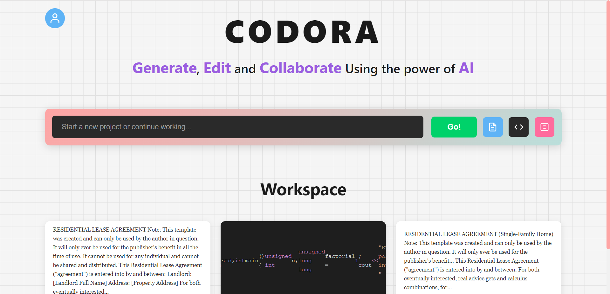
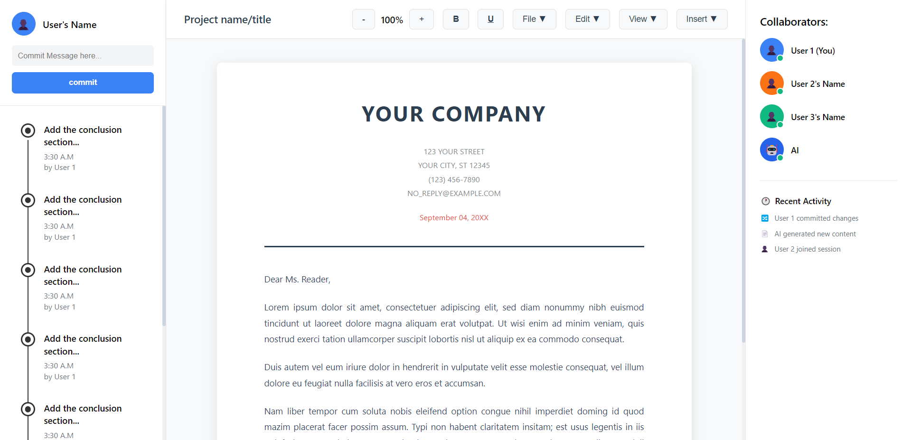
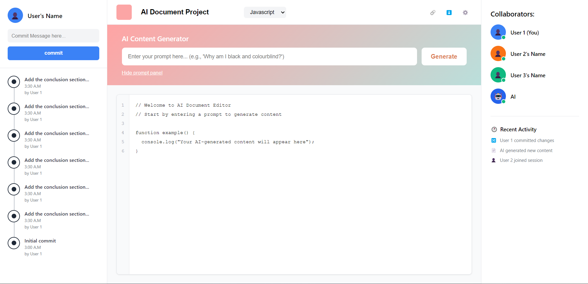

#  CODORA

CODORA is a collaborative AI workspace for writing documents and generating code.
It includes a Django backend and a static frontend with pages for login, dashboard, document editing, and code editing.

<p align="center">
  
</p>

## Project Structure

- `backend/` - Django API and project logic
- `frontend/` - Web UI pages and scripts
- `Previews/` - UI screenshots

## Quick Start

1. Open a terminal in `backend/`.
2. Install dependencies:

```bash
pip install -r requirements.txt
```

3. Run the server:

```bash
python manage.py runserver
```

4. Open the frontend pages from `frontend/` in your browser.

## Preview

### Document Editing

<p align="center">
  
</p>

### Code Generation

<p align="center">
  
</p>
